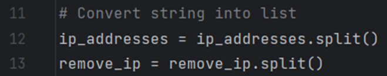
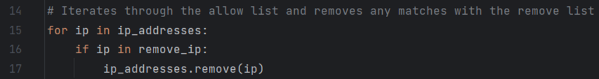
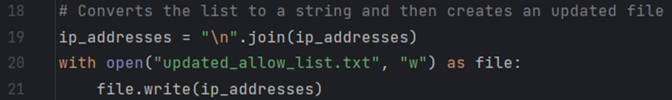
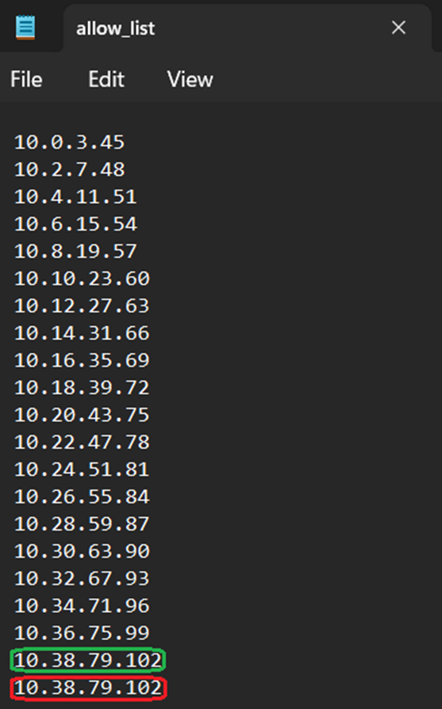
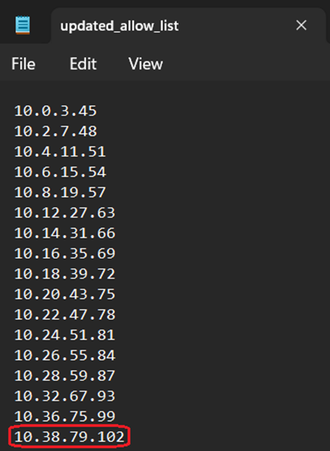

<!DOCTYPE html>
<html>
<head>
    <h1>Algorithm for file updates in Python</h1>
</head>
<body>
    
In the context of this project, I assume the role of a security professional. A fundamental aspect of my responsibilities entails the routine maintenance of a file that serves to identify employees authorized to access restricted content. To streamline this task and mitigate the potential for human error, I have developed a Python script. This script operates as an algorithm designed to assess the intersection between the "allow list" and the "remove list." When matches are detected, it removes them from the "allow list," ensuring the integrity of our access control mechanisms.

    <h2>Open the file that contains the allow list</h2>
    
The first thing to do is open the files to read them, for this I used the <code>open()</code> function, the first argument is the exact file or file path that I want to be read, “allow_list.txt”, and the second is the mode of the function, in this case “r”, which means that is going to read the file. Additionally it is considered best practice when working with files in python, to use the <code>with</code> statement, this helps open and close the file dynamically when is needed, preventing resource leaks. It also stores the file in a variable, using the keyword as followed by the variable name.

    
    <h2>Read the file contents</h2>
    
In the image, above, you can see that after the files are opened they are read through the method <code>.read()</code>, this is because to be able to work with the data inside the file it has to be a python data type, in this case it is converted to a string and stored inside the variable <code>ip_addresses</code>, this variable, unlike the variable file, is going to be useful to work with the data outside the <code>with</code> statement. It is essential that the lines of code that are meant to be inside the <code>with</code> statement are properly indented, this way we prevent errors.

    <h2>Convert the strings into lists</h2>
    
It is convenient to convert the string into a list, this way it’s easier to iterate through each element of the list to compare them. This is done using the <code>.split()</code> method, the method separates the strings based on a specified character passed into <code>.split()</code> as an argument, if you do not pass any arguments then it separates the string based on the blank spaces, such as a space or a new line (<code>\n</code>). After that the list is reassigned to the same variable, <code>ip_addresses</code> or <code>remove_ip</code>, as you can see in the image below, the data is being separated by blank spaces.

    
    <h2>Iterate through the allow list</h2>
    
The next step is to search through the allow list for any IP address that has to be removed due to employees changing to tasks that do not need access to that information. I did this with a <code>for</code> loop, a loop that iterates over a sequence, using the <code>ip_addresses</code> list as the guide sequence. It is also worth noting the temporal variable <code>ip</code>, this variable is temporarily created to be used inside the <code>for</code> loop, and it will take the values of each element of the list.

    
    <h2>Remove the IP addresses in the remove list</h2>
    
To be able to identify if there are IP addresses in the allow list that should not be there a conditional, <code>if</code> statement, is used inside the <code>for</code> loop, this way the condition is tested on every element of the <code>ip_addresses</code> list, in this case the condition is that the element has to be inside the remove list, as it’s shown on the image above <code>ip in remove_ip:</code>. If the condition is met then the next line of code is executed <code>ip_addresses.remove(ip)</code>, <code>.remove()</code> is a method that removes the first match of its argument on a given list.

    <h2>Update the file</h2>
    
Now that the <code>ip_addresses</code> variable only has the correct IP addresses it’s time to write the data into a new updated file, or simply update the old one. To facilitate this, I change data types from list to string, using the method <code>.join()</code>, this method is a bit different that the others, since the list you want to convert to a string (<code>ip_addresses</code>) goes inside the argument of the method, and the string that is going to be used to separate each element of the list (<code>“\n”</code>) comes before the point. Then I used the <code>with open()</code> statement, in <code>“w”</code> mode to write into a new file called <code>“updated_allow_list.txt”</code>, if this file does not exist then the function creates it. Finally the data stored on <code>ip_addresses</code> is written into the file variable through the <code>.write()</code> method.

    
    <h2>Summary</h2>
    
With this project I can showcase my understanding of python scripting for automation of repetitive tasks, this greatly helps saving time and reducing human error.That being said, the final script has room for improvements, for example, one serious vulnerability that I can see is the fact that if an IP address is repeated inside the allow list, then this code is not going to remove it, this way an attacker just have to insert its IP address twice in the allow list and would be safe from being removed. As you can see here:

    <table>
      <tr>
        <td></td>
        <td></td>
      </tr>
      <tr>
        <td>Before the script ran</td>
        <td>After the script ran</td>
      </tr>
    </table>
    
All IP addresses were removed successfully except the highlighted ones, this is because the .remove() method just removes the first matching element of the list but the highlighted were repeated. For this reason I kept the PEP 8 style guidelines in mind, as a result the code is more readable and has comments that might help others, or myself, update and patch the code if needed.

</body>
</html>

