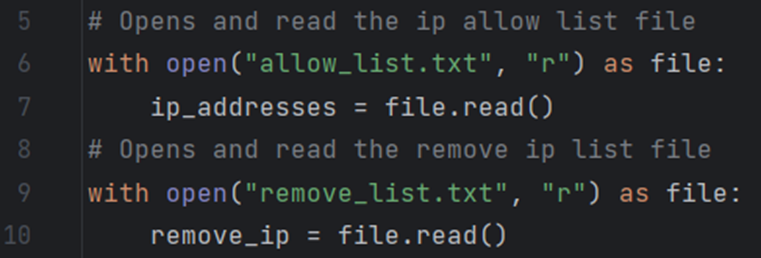

<!DOCTYPE html>
<html>
<head>
    <title>Algorithm for file updates in Python</title>
</head>
<body>
    
Project description

    
In the context of this project, I assume the role of a security professional. A fundamental aspect of my responsibilities entails the routine maintenance of a file that serves to identify employees authorized to access restricted content. To streamline this task and mitigate the potential for human error, I have developed a Python script. This script operates as an algorithm designed to assess the intersection between the "allow list" and the "remove list." When matches are detected, it removes them from the "allow list," ensuring the integrity of our access control mechanisms.

    <h2>Open the file that contains the allow list</h2>
    
The first thing to do is open the files to read them, for this I used the open() function, the first argument is the exact file or file path that I want to be read, “allow_list.txt”, and the second is the mode of the function, in this case “r”, which means that is going to read the file. Additionally it is considered best practice when working with files in python, to use the with statement, this helps open and close the file dynamically when is needed, preventing resource leaks. It also stores the file in a variable, using the keyword as followed by the variable name.

    
    <h2>Read the file contents</h2>
    <!-- Add your code snippet and description here -->
</body>
</html>

